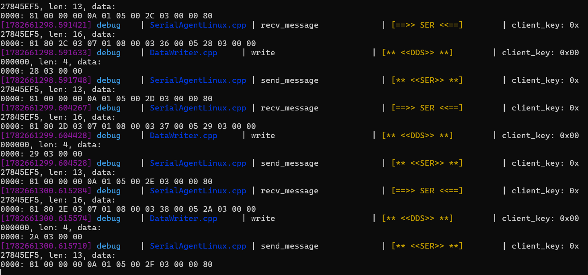
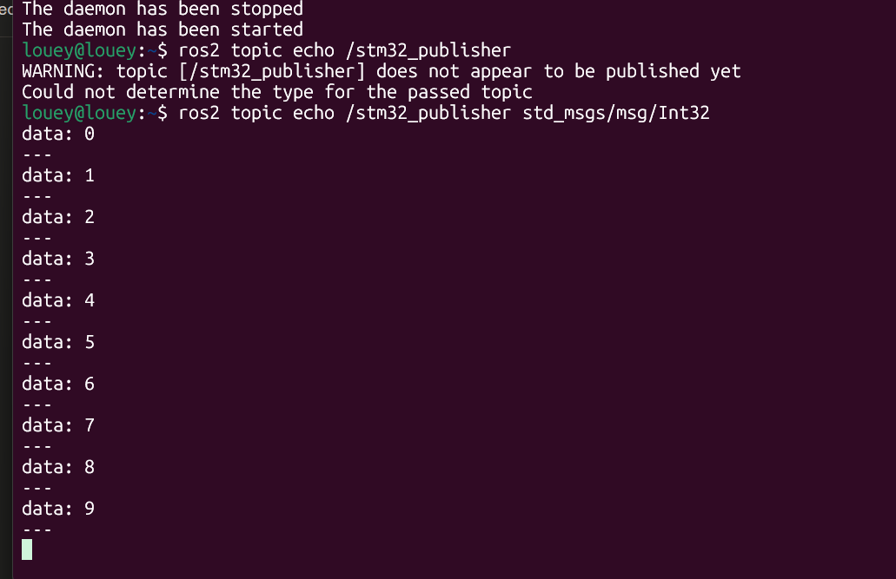

# micro-ROS on STM32F401RE

This project demonstrates a micro-ROS client running on an STM32F401RE microcontroller with FreeRTOS and a custom UART transport. The firmware connects to a micro-ROS agent on a Linux host, creates a ROS 2 node and publisher, and sends a counter message once per second over USART2 using DMA-backed transport.

The repository is named `micro_ros_DHT11` because it is intended to become an STM32-to-ROS 2 DHT11 sensor project. The current checked-in application is a communication proof of concept: `Core/Src/dht11.c` and `Core/Inc/dht11.h` are present but empty, and the active task publishes `std_msgs/msg/Int32` counter values rather than temperature or humidity measurements. This README describes both the working transport demo and the remaining DHT11 integration work.

## Demonstrated result

The included screenshots show the complete communication path:

1. The micro-ROS agent receives and transmits XRCE-DDS serial frames from the STM32 client.
2. A ROS 2 host terminal subscribes to `/stm32_publisher` and receives incrementing values from `0` onward.



*Figure 1. micro-ROS agent serial transport and DDS traffic.*



*Figure 2. ROS 2 host receiving incrementing messages from the STM32 publisher.*

## Current software behavior

The active FreeRTOS task in `Core/Src/main.c` performs this sequence:

1. Blink the board LED on `PA5` during startup.
2. Register a custom micro-ROS transport using `USART2`.
3. Install the custom allocator functions.
4. Initialize the micro-ROS support layer.
5. Create the node `stm32_node`.
6. Create a publisher for `std_msgs/msg/Int32` on `stm32_publisher`.
7. Publish the current counter value.
8. Increment the counter after a successful publish.
9. Toggle the LED and wait 1000 ms before publishing again.

The resulting ROS 2 command is:

```bash
ros2 topic echo /stm32_publisher std_msgs/msg/Int32
```

Expected output is an incrementing sequence:

```text
data: 0
---
data: 1
---
data: 2
```

The firmware currently has no DHT11 read call, no temperature/humidity message, and no DHT11 topic. Those should be added as a separate application step after the transport is verified.

## Architecture

```text
DHT11 sensor (planned)
        |
        v
STM32F401RE + FreeRTOS
  - DHT11 driver (to be implemented)
  - micro-ROS node: stm32_node
  - publisher: stm32_publisher
        |
        | USART2, 115200 baud, custom transport + DMA
        v
micro-ROS Agent on Linux
        |
        v
ROS 2 graph and subscribers
```

### STM32 application

The project targets an STM32F401RE and uses STM32CubeIDE-generated startup, clock, GPIO, UART, DMA, timer, and FreeRTOS support. The CPU currently uses the HSI clock with no PLL multiplier, and USART2 is configured for 115200 baud, 8 data bits, no parity, and one stop bit.

### FreeRTOS

The default task is created with normal priority and a stack depth of 2000 words. FreeRTOS starts the scheduler after HAL and peripheral initialization. The micro-ROS client runs from this task and uses `osDelay(1000)` between publications.

### micro-ROS transport

The project uses the `rmw_uros_set_custom_transport` API to connect micro-ROS to the CubeMX UART handle. The transport implementation is located in `Core/microros_src/`:

- `dma_transport.c`: custom open, close, read, and write operations for USART2 DMA transport
- `custom_memory_manager.c`: memory-management support
- `microros_allocators.c`: allocator callbacks registered with `rcutils`
- `microros_time.c`: time support for the micro-ROS client

The transport is configured as serial communication and is expected to connect to a micro-ROS agent running on the host.

## Host-side micro-ROS setup

The host requires ROS 2 and the micro-ROS agent package. The exact serial device depends on the Linux system and ST-LINK/UART wiring. A typical workflow is:

### Start the agent

```bash
ros2 run micro_ros_agent micro_ros_agent serial --dev /dev/ttyACM0 -b 115200 -v6
```

Replace `/dev/ttyACM0` with the serial device assigned to the board. The `-v6` option enables verbose agent logs similar to the included serial-traffic screenshot.

### Inspect the ROS 2 graph

```bash
ros2 node list
ros2 topic list
ros2 topic info /stm32_publisher
```

### Subscribe to the counter

```bash
ros2 topic echo /stm32_publisher std_msgs/msg/Int32
```

The warning shown in the screenshot can occur when `ros2 topic echo` is started before the publisher has been discovered. Start the agent and flash/run the STM32 client first, then retry the command after the topic appears in `ros2 topic list`.

## Hardware requirements

- STM32F401RE development board or compatible custom board
- ST-LINK debugger/programmer
- USB or UART connection between USART2 and the Linux host or serial adapter
- 3.3 V-compatible UART levels
- Optional DHT11 sensor for the planned sensor integration
- Linux machine with ROS 2 and micro-ROS agent support

Do not connect a 5 V UART signal directly to a 3.3 V STM32 input. Confirm the board-specific USART2 pin mapping in `microros_f401.ioc` and the serial device exposed by the debug probe or adapter.

## Build and flash with STM32CubeIDE

1. Install STM32CubeIDE with STM32F4 device support.
2. Import this directory as an existing STM32CubeIDE project.
3. Confirm that the selected device is STM32F401RETX.
4. Review `microros_f401.ioc` for UART2, DMA, GPIO, timer, and FreeRTOS settings.
5. Ensure the generated micro-ROS library and include paths are available to the project.
6. Build the Debug configuration.
7. Connect the ST-LINK debugger and flash the board.
8. Start the micro-ROS agent on the host.
9. Verify the LED heartbeat and inspect `/stm32_publisher` with ROS 2.

The repository includes the project-specific micro-ROS integration sources under `Core/microros_src/`, but a complete rebuild may still require the same micro-ROS library generation environment used to create the original project. Generated `Debug/` and `Release/` directories are excluded from Git.

## DHT11 integration roadmap

To turn the current communication demo into the intended DHT11 sensor application:

1. Assign one GPIO data pin for the DHT11 in `microros_f401.ioc`.
2. Implement the DHT11 start pulse and 40-bit response timing in `dht11.c`.
3. Use a microsecond timer or DWT cycle counter for the sensor timing windows.
4. Validate the 8-bit humidity, humidity decimal, temperature, temperature decimal, and checksum bytes.
5. Enforce the DHT11 minimum sampling interval of approximately one second.
6. Add a ROS 2 message type, such as `sensor_msgs/msg/Temperature`, or publish a simple custom message containing temperature and humidity.
7. Replace the counter publisher payload with the validated sensor values.
8. Publish separate topics such as `/dht11/temperature` and `/dht11/humidity`, or use one structured message.
9. Add timeout and checksum error handling so a disconnected sensor cannot block the FreeRTOS task.
10. Verify the new topics with `ros2 topic echo` and record a sensor reading screenshot.

The existing one-second publication interval is compatible with the DHT11's slow sampling rate, but the current counter loop is not yet connected to a sensor read operation.

## Repository layout

```text
Core/
  Inc/              Application headers, FreeRTOS config, and DHT11 placeholders
  Src/              Main micro-ROS task, FreeRTOS setup, and DHT11 placeholders
  microros_src/     Custom UART/DMA transport, allocators, and time support
  Startup/          STM32F401RE Cortex-M4 startup assembly
Drivers/            CMSIS and STM32F4 HAL dependencies
microros_f401.ioc   STM32CubeMX peripheral configuration
*.ld                STM32F401RETX linker scripts
micro-ros-agent-traffic.png  Agent serial/DDS traffic screenshot
ros2-topic-echo.png           ROS 2 subscription screenshot
README.md           Project description and setup guide
```

## Troubleshooting

### The agent receives no serial data

Check the selected `/dev/tty*` device, UART wiring, baud rate, board power, and USART2 pin configuration. Close other serial monitors that may own the port.

### `ros2 topic echo` cannot determine the type

Start the agent and the STM32 client first, wait for discovery, then run `ros2 topic list` and `ros2 topic info /stm32_publisher`. Use the exact type `std_msgs/msg/Int32` for the current firmware.

### The LED blinks rapidly

The application has entered `Error_Handler`, commonly because micro-ROS support initialization failed. Check agent availability, transport configuration, allocator setup, and the generated micro-ROS library.

### The topic exists but values do not advance

Check that the publisher is returning `RCL_RET_OK`, that the scheduler is running, and that the serial transport can send complete frames. Enable verbose agent logging to inspect XRCE-DDS traffic.

## Limitations

- DHT11 support is scaffolded but not implemented in the current source.
- The active ROS 2 payload is an incrementing `Int32`, not environmental data.
- The transport depends on a compatible micro-ROS agent and generated client library.
- The host-side screenshots demonstrate communication but are not automated tests.
- The blocking sensor protocol and serial transport should be protected by timeouts before deployment.

## License

No separate project license has been added. Add an appropriate license before distributing or publishing the repository.